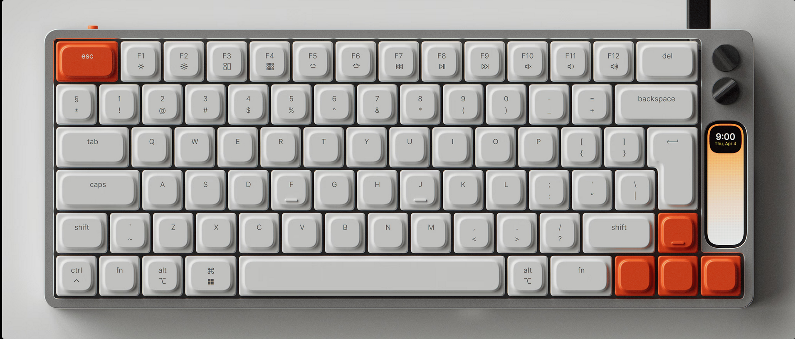
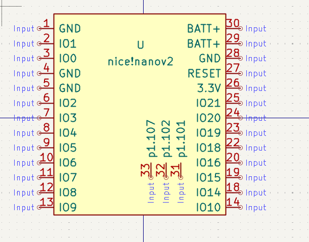
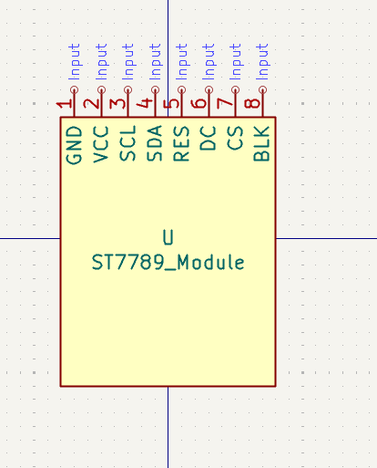
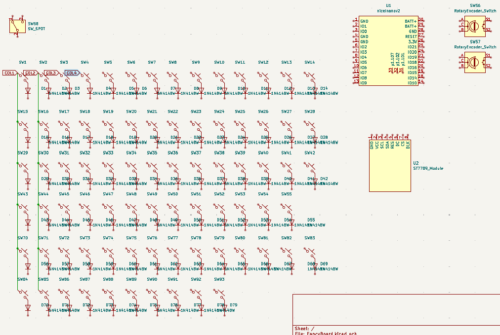
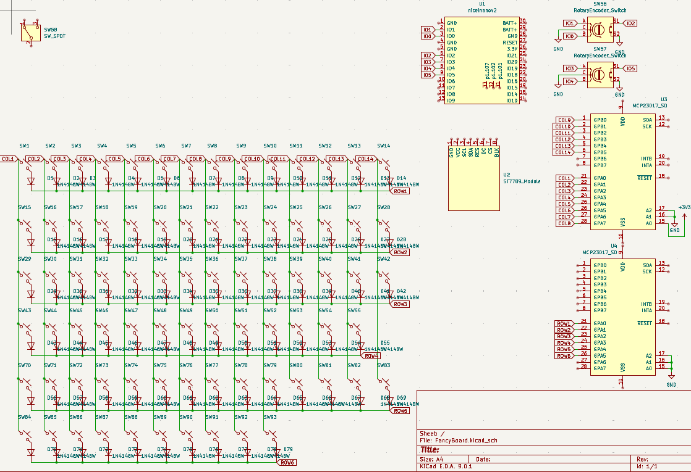
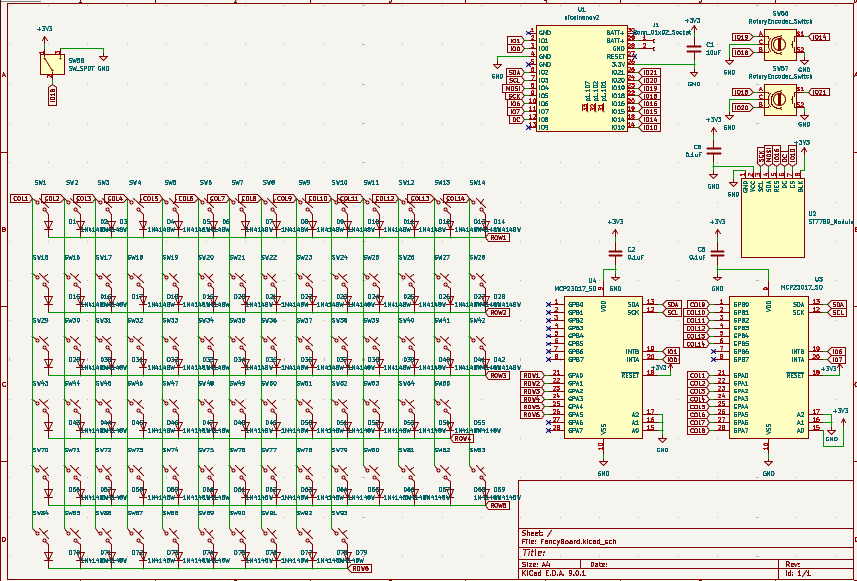

# FancyBoard
## july 28th

speedrunning a keyboard before the 31st, just because

i was inspired for making this keyboard by the KNOB keyboard, which ive seen and always thought looked like the perfect keyboard. unfortunately, its $439, bad, so i'll try to make something similar for $150

KNOB:

planned features:
- nice mechanical switches
- keycaps, i wont be using low profile because i personally dont like it
- hotswappable
- 2 dials
- oled screen
- both usb c and bluetooth connectivity
- usb c charging
- 3000mAh battery for big battery life

ill be using the nice!nano v2 because it consumes very little power, has battery charging built in, and has bluetooth HID + usb c HID already

parts list:

| Component                 | Part                               | Notes                                             |
| ------------------------- | ---------------------------------- | ------------------------------------------------- |
| Microcontroller           | Nice!Nano V2                       | nRF52840 + integrated battery charger             |
| Battery                   | 3.7V Li-ion 3000mAh (flat, JST-PH) | Rechargeable                                      |
| USB Port                  | JST to USB-C charging cable        | Board already has onboard USB                     |
| Rotary Encoder            | EC11 w/ push button                | For volume/menu                                   |
|     Screen                | ST7789 1.14"                       | SPI, vertical     https://www.aliexpress.com/item/1005009445748262.html                                |

| Component       | Part                                        | Notes                 |
| --------------- | ------------------------------------------- | --------------------- |
| Switches        | 78x Tactile MX Switches                     |                       |
| Diodes          | 1N4148W SMD                                 |                       |
| Hotswap Sockets | 78x Kailh MX sockets                        |                       |
| Keycaps         | SA / DSA / OEM profile                      | PC or PBT preferred   |
| Encoder Knob    | Aluminum / ABS cap                          |                       |

# schematic

microcontroller symbol done!

+3 hours

done with ST7789_Module symbol

current progress of schematic

+2 hours

adding 2 MCP23017 because i need a lot more io

## july 29th

added all the components, need to complete wiring

finished most of everything, need to add some pull up resistors and capacitors and stuff

+3 hours