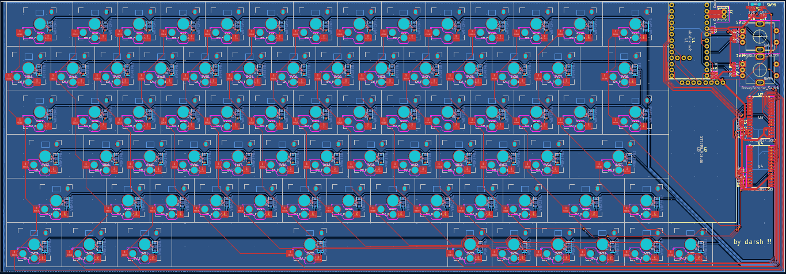

# FancyBoard

FancyBoard is a custom hot-swappable mechanical keyboard inspired by the k.no.b.1 from Work Louder.

- Hot Swappable
- ZMK Firmware
- Low Profile
- Bluetooth & USB-C
- 1.9" IPS Display
- 65% layout
- 2 Dials

i made this keyboard because i saw the KNOB keyboard on reels, and thought it was probably the nicest looking keyboard ive seen, but unfortunately its like 400usd, way too expensive

i wanted to learn how to make a full keyboard after hackpad anyways, so i designed this. i also want a bluetooth keyboard because my current keyboard has a cable thats very annoying, and i wanted to replace it.

## BOM
|Reference             |Value                      |Footprint                                                    |Qty|Link                                                 |Price (USD)|
|----------------------|---------------------------|-------------------------------------------------------------|---|-----------------------------------------------------|-----------|
|C1                    |10uF                       |Capacitor_SMD:C_0603_1608Metric                              |1  |https://www.aliexpress.com/item/1005002761630440.html|3.13       |
|C2,C5,C6              |0.1uF                      |Capacitor_SMD:C_0603_1608Metric                              |3  |                                                     |           |
|D1-D79                |1N4148W                    |Diode_SMD:D_SOD-123                                          |78 |https://www.aliexpress.com/item/1005006123061230.html|2.8        |
|J1                    |Conn_01x02_Socket          |Connector_JST:JST_PH_B2B-PH-K_1x02_P2.00mm_Vertical          |1  |https://www.aliexpress.com/item/1005004955655144.html|2          |
|R1,R6,R7,R8,R9,R10,R11|10K                        |Resistor_SMD:R_0603_1608Metric                               |7  |https://www.aliexpress.com/item/1005008912576822.html|1.9        |
|R2,R3,R4,R5           |4.7K                       |Resistor_SMD:R_0603_1608Metric                               |4  |https://www.aliexpress.com/item/1005008912576822.html|1.9        |
|SW2-SW78              |SW_Push_45deg              |Kailh_PG1353_Hotswap:Kailh-PG1353-Hotswap                    |78 |https://www.aliexpress.com/item/1005008644185126.html|32.61      |
|SW93,SW94             |RotaryEncoder_Switch       |Rotary_Encoder:RotaryEncoder_Alps_EC11E-Switch_Vertical_H20mm|2  |https://www.aliexpress.com/item/1005007644083514.html|2.25       |
|SW95                  |SW_SPDT                    |MSK-12C02:MSK-12C02                                          |1  |https://www.aliexpress.com/item/1005009568929894.html|2.13       |
|U1                    |nice!nanov2                |nice!nanov2:nice!nanov2                                      |1  |https://www.aliexpress.com/item/1005007266112508.html|3.02       |
|U2                    |ST7789_Module              |ST7789_Module:ST7789_Module                                  |1  |https://www.aliexpress.com/item/1005006042323705.html|2.54       |
|U3,U4                 |MCP23017_SO                |Package_SO:SOIC-28W_7.5x17.9mm_P1.27mm                       |2  |https://www.aliexpress.com/item/1005009559642041.html|4.07       |
|                      |Kailh Choc Stabilizers     |                                                             |1  |https://www.aliexpress.com/item/1005006528731543.html|8.65       |
|                      |Kailh Choc Keycaps         |                                                             |78 |https://www.aliexpress.com/item/1005008146995393.html|15.76      |
|                      |Kalih Choc Hot Swap Sockets|                                                             |78 |https://www.aliexpress.com/item/1005006625852715.html|9.73       |
|                      |1s LiPo 500mAh Battery     |                                                             |1  |https://www.aliexpress.com/item/1005007016796736.html|9.15       |
|                      |PCB                        |                                                             |   |https://jlcpcb.com                                   |19         |
|Subtotal              |                           |                                                             |   |                                                     |120.64     |
|AliExpress Shipping   |                           |                                                             |   |                                                     |9.28       |
|JLCPCB Shipping       |                           |                                                             |   |                                                     |13.14      |
|Total                 |                           |                                                             |   |                                                     |143.06     |
